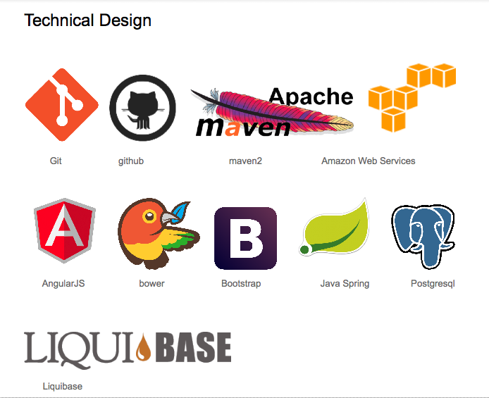
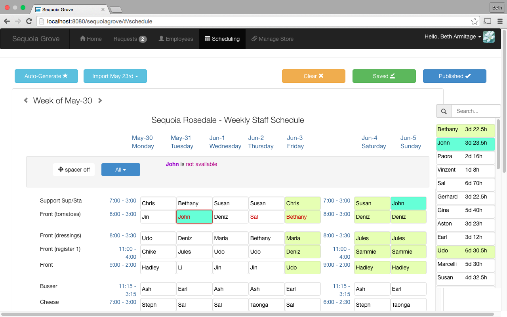
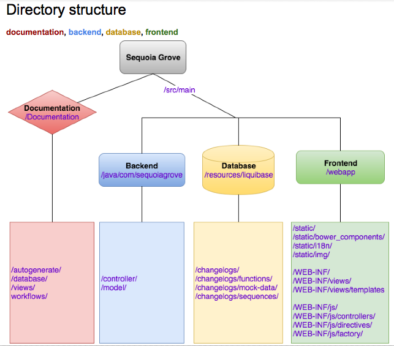

Sequoia Grove
==
Simple Employee Scheduling.

Sequoia Grove was designed for businesses following a scheduling system where work schedules
with shifts are written and published weekly. The model for this product was
constructed by researching the current system in place by a  local Delicatessen,
[The Sequoia Sandwich Company](http://www.sequoiasandwich.com/v4/).
The application then expands on the model by being built generically enough
to accommodate any business operating on a similar basis.
Project satisfies senior project requirement for bachelor's degree of computer
science at California State University, Bakersfield (CSUB)

Technical Design
--

[Detailed Project Description](documentation/feature-description.md)

Directory Structure
--

Contribution Guidelines
--
pending

Setting up Development Environment
--
#### Tools you need to install
Mac OSX - I suggest [Homebrew](http://brew.sh/), Linux - use your package manager

* [Maven](https://maven.apache.org/) `brew install maven`
* [npm](https://www.npmjs.com/) `brew install npm`
* [bower](http://bower.io/) `npm install -g bower`

#### Setup Project
* Install Javascript dependencies: `bower install`
* Install Java dependencies : `mvn clean install`
* jdbc.properties needs database connection credentials in /src/main/webapp/WEB-INF/
* liqubase.properties needs database connection credentials in /src/main/resources/liquibase/
* there's probably something I forgot, like jar for postgresql, or something

#### Run Project
* `mvn jetty:run`
* navigate to [localhost:8080/sequoiagrove/](localhost:8080/sequoiagrove/)

Patch Notes
--
* **v1.0.0.2-BETA** fix where spacers in schedule threw error in mobile list calculation
* **v1.0.0.1-BETA** Initial beta release, add mobile friendly schedule view

License
--
[AGPLV3](http://www.gnu.org/licenses/agpl-3.0.html)

