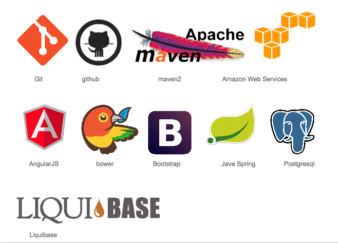
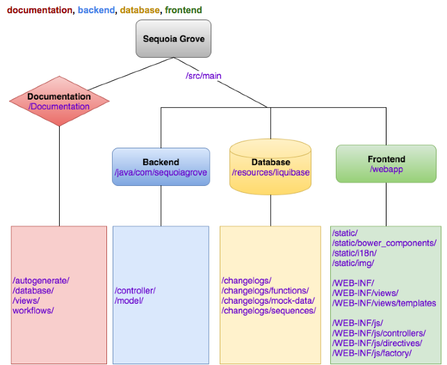

Sequoia Grove
==
Weekly Employee Scheduling Application

Sequoia Grove is a web application designed to simplify employee scheduling. 
It was designed for businesses following a scheduling system where work schedules 
with shifts are written and published weekly. The model for this product was 
constructed by researching the current system in place by a  local Delicatessen, 
[The Sequoia Sandwich Company](http://www.sequoiasandwich.com/v4/). 
The application then expands on the model by being built generically enough 
to accommodate any business operating on a similar basis.
Project satisfies senior project requirement for bachelor's degree of computer 
science at California State University, Bakersfield (CSUB)

[More Detailed Project Description](documentation/feature-description.md)

Technical Design
--

Directory Structure
--

License
--
[AGPLV3](http://www.gnu.org/licenses/agpl-3.0.html)

Contribution
--
Contribution rules pending

Collaborators
--
* [Beth](https://github.com/bethgrace5)
* [Sunny](https://github.com/jsumal)
* [Ted](https://github.com/tpascua11)
* [AJ](https://github.com/amadorjoaosilva)

