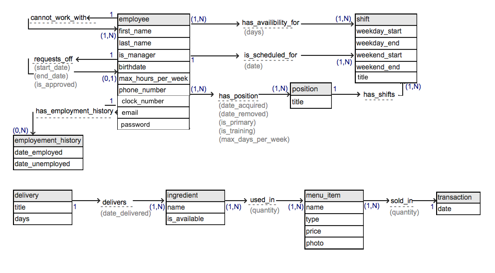

Phase I 
--
([Instructions](http://www.cs.csub.edu/~hwang/CS342/342_phase1.txt))
Fact-Finding Techniques and Information Gathering

1.1 The Sequoia Sandwhich Company is a local popular high quality delicatessen
that sepcializes in homemade sandwiches, salads, soups, and bakery desserts.
They also offer catering for groups in the form of sandwich platters, boxed lunches,
along with options to add beverages, chips and side salads.

There are currently four locations:
Downtown, southwest, rosedale, and the Fresno/Clovis area.

1.2 The fact-finding methods used to gather the data was about four years
past experience of working for the company, as well as facts collected
from the website. The operations on the data will be handled by the
person in charge of scheduling which is usually the branch manager at
the location. The database will be used to generate reports consisting
of information about employees and their availability. 

1.3 The part of the enterprise that the conceptual database will be designed
for is employee scheduling.  Major entity set and relationship sets will
include Employee information, Employee Positions, Shift openings, Employee
Availability, and specific information about which employees are scheduled
for which shifts in what positions.

1.4 Itemized descriptions of Entity sets and relationship sets: 

including their names, meaning, attribute names and detail
properties of each attributes, cardialities and participation
constraints of relationship.

Itemized descriptions of Entity and Relationship Sets

    Entity Employee(
        EmployeeID      integer [primary key],
        firstname       string  [attribute],
        lastname        string  [attribute],
        dateEmployed    date    [attribute],
        dateUnemployed  date    [attribute],
        birthday        date    [attribute],
        maxHoursPerWeek integer [attribute],
        primary_phone   string  [attribute],
        secondary_phone string  [attribute])

    Entity Role(
        RoleID     Integer [primary key],
        Title      string  [attribute])

    Entity Shift(
        ShiftID        integer [primary key],
        RoleID         Integer [foreign key],
        title          string  [attribute],
        weekday_start  time    [attribute],
        weekday_end    time    [attribute],
        weekend_start  time    [attribute],
        weekend_end    time    [attribute])

    Entity Delivery(
        deliveryID   integer  [primary key],
        companyTitle string [attribute],
        weekdays     set [multivalued attribute])

    Relationship (Identity Relationship?) Requests_Off(
        requestedBy EmployeeID [foreign key - Employee],
        grantedBy   EmployeeID [foreign key - Employee],
        day_start   date       [attribute],
        day_end     date       [attribute])
    Employee:Employee 1:1 - one employee submits request , one employee approves request
    participation constraint - none

    Relationship Has_Role(
        EmployeeID     integer [foreign key].
        RoleID         integer [foreign key].
        is_training    boolean [attribute],
        date_acquired  date    [attribute].
        date_removed   date    [attribute].
        is_primary     boolean [attribute].
        maxDaysPerWeek date    [attribute])
    Employee:Role n:m - employees may have many different roles, a role may be occupied by many different employees
    participation constraint (total) all employee must have at least one role,
    (for example, an employee may be trained as a salad and hot sandwich prep, and there are several employees that might be
    sandwich preps or salad preps)

    Relationship Has_Shifts(
        roleID  integer [foreign key])
        shiftID integer [foreign key],
    Role:Shift 1:1 one shift is occupied by one role
    (for example, there may be a 8AM-3PM shift for both a cashier and a janitor, as well as other cashier and janitor shifts)

    Relationship Is_Scheduled_For(
        employeeID integer [foreign key],
        shiftID    integer [foreign key],
        day        date    [attribute])
    Employee:Shift 1:1 - only one employee is scheduled for a specific shift

    Relationship Has_Availability_For(
        EmployeeID integer [foreign key],
        shiftID    integer [foreign key])
    Employee:Shift m:n - many employees may be available for many shifts
    participation constraint - at least one employee must be available for each shift

    (can two columns have the same name?)
    Relationship Cannot_Work_With(
        employeeID integer [foreign key],
        employeeID integer [foreign key])
    Employee:Employee 1:1 - some employees cannot work well with others

1.5 User Groups are defined by Employee Roles
In descending order of privelage are: managers (branch manager and store owner),
shift supervisors, and all other employees (cashiers, janitors, food prep...)

managers-
* reading, creating, updating and deleting schedules (past schedules may not be deleted)
* reading, creating, updating and deleting employees
* reading(view requests off), creating(submit requests off), and updating (approve/deny) requests off
* reading, creating, updating, and deleting scheduled weekly deliveries

all employees-
* reading schedules
* reading (view own requests off only), creating(submit requests off), and updating (cancel own requests off)
* reading weekly deliveries (shown on schedule)

For step 2, document the conceptual database design

2. Conceptual Database Design

2.1 Entity Set Desciption

Entity UVW:
* name (use intuitive name
* description: what is the purpose of the entity
type, what information are held in the entities
of the relationship type, and other information
about the entities in the set (such the frequencies
of insertion, deletions, and updates).
* Attribute description
- name
- descriptin
- domain/type
- value-range
- default value
- null value allowed or not?
- unique?
- single or multiple-value
- Simple of Composite

* candidate keys:
* primary key:
* Strong/Weak Entity
* Fields to be indexed

Entity XYZ:
...

2.2 Relationship Set Description

Relationship ...:
* Name (use intuitive name)
* description: What is the relationship type for, the
purpose of relations, what are the entities involved,
meaning of each descriptive data field. Multiplicities
and mapping cardinality.
* Entity set involved
* Mapping cardinality
* Desciptive field
* Participation Constraint:
Partial/optional or total/mandatory

2.3 Related Entity Set

Describe the following and point out entity types and relationships
that are derived with the specialization/generalization process.

* Specialization/Generalization Relationships(is-A)
Participation constraint
Disjoint constraint
* Aggregation/has-relationship
Composite

2.4 E-R Diagram

Label the entity types with attributes, relationship types,
multiplicities.

