Sequoia Grove
--
Employee Scheduling Application

## Login
The system requires users to hold a Google account. If the user does not have one,
they may sign up for one from google. Additionally, the user must exist as a currently
employed user in the system in order to continue.
Users may be classified as Account Holder, Manager or Employee. Default permissions
are given based on classification.

## Home
All users able to login to the system will be able to view any schedule that is published.
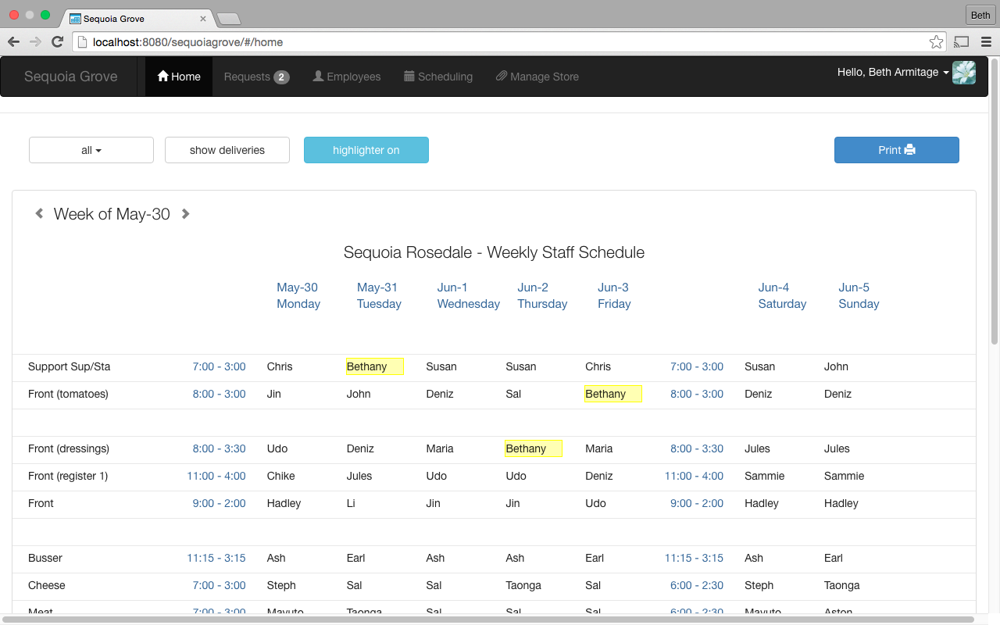

## Requests
Employees with permission to do so will be able to submit vacation requests. Managers
have the ability to answer pending requests, view the history of all requests, and submit
a request for any employee.
Submit Requests
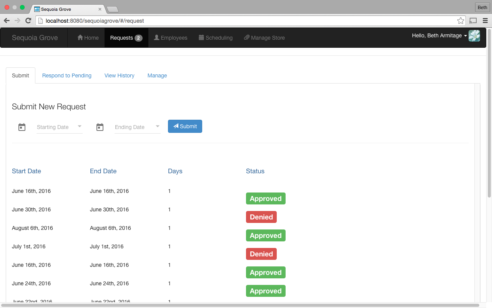
Pending Requests
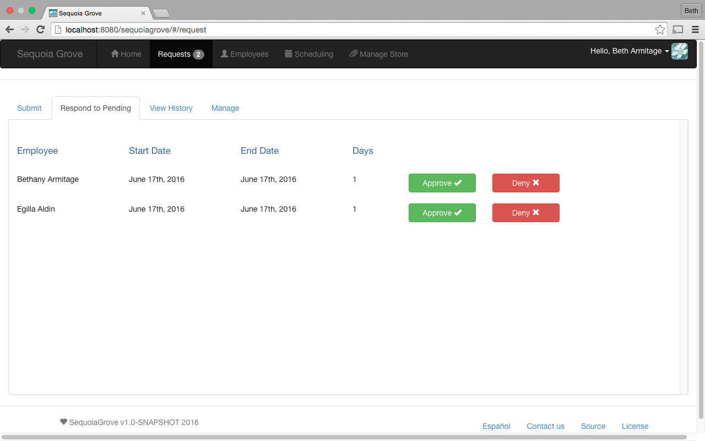
Request History
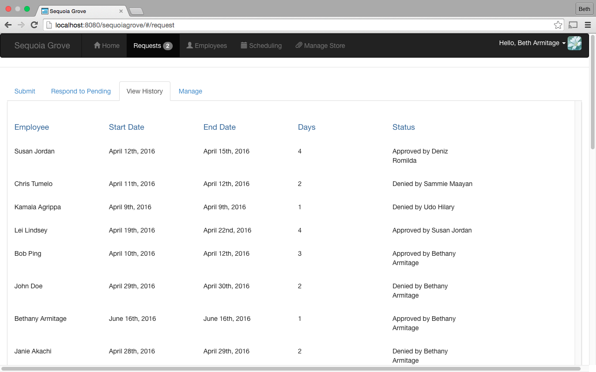
Manage Requests
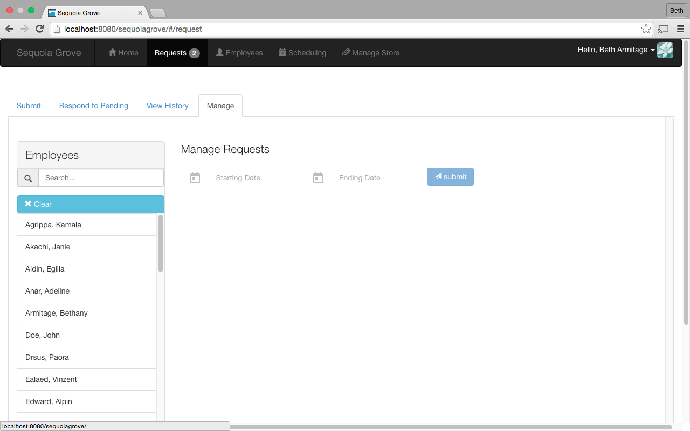

## Edit Employee
Those with permission to edit employees will have access to do so. A new employee may
be added, or an existing employee may be edited. The basic info, availability and
positions are editable. Additionally the employee may be marked as employed or unemployed.
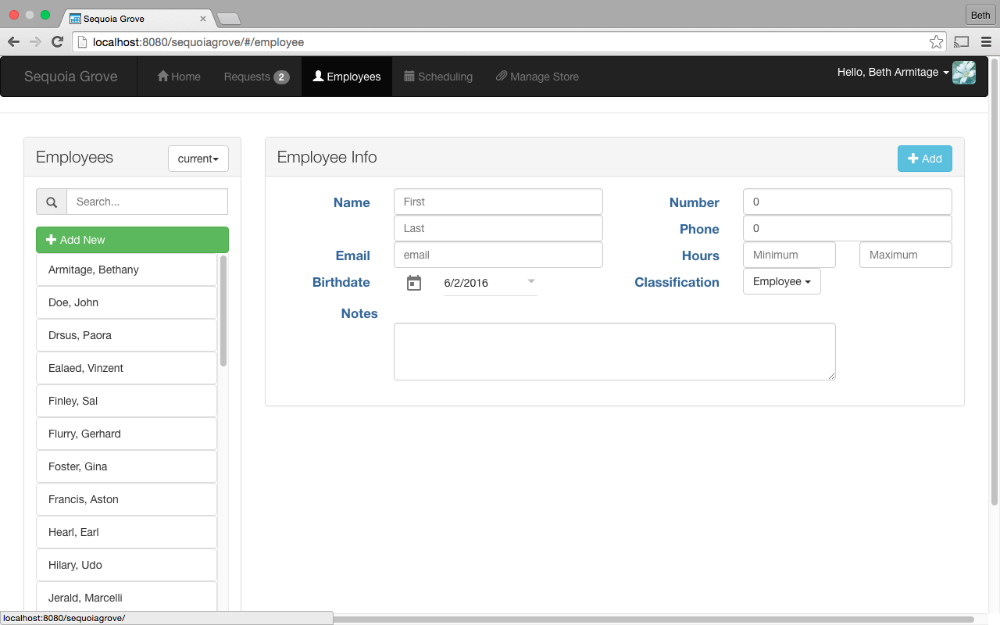
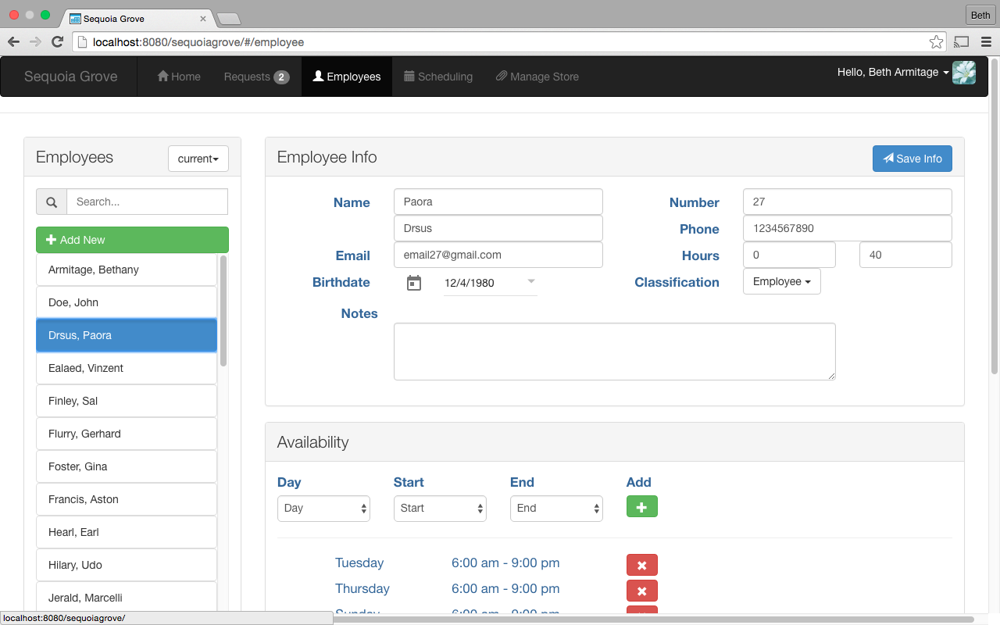
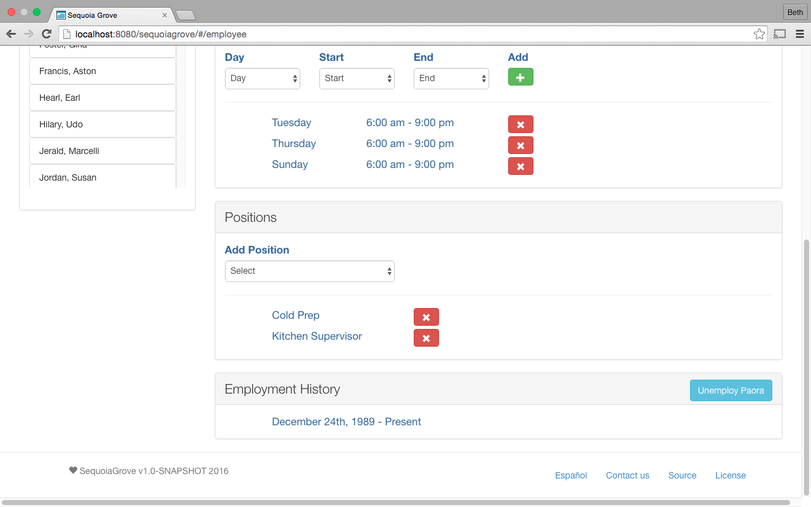

## Edit Schedule
Managers may edit schedules. They can auto generate a schedule, and make any
changes to it. They also can manually create a schedule as necessary. The
schedule editor will make it easy to spot which employees can work which shifts.
It will protect/warn against scheduling an employee where they cannot work. There
are a few reasons an employee will not be able to work a shift on a specific day;
the employee does not have availibility for that shift, the employee is not trained
in the role that that shift requires, the employee has requested that day off, or
that shift overlaps with one being worked by an employee they do not work well with.
It will be possible to override any warnings given as necessary or practical. To
manually schedule employees, either click an employee or an empty shift for a day.
Clicking an employee highlights all shifts they can possibly work each day, given
that they are not already placed on the schedule for that day. Clicking a shift
that needs to be filled highlights all employees who are trained in that role,
who are available for that day, who are not already on the schedule for that day,
who have not requested that specific day off, where they will not be placed to
work with employees they cannot work with. Schedules relevant to the current week,
and future weeks will be able to be edited. Schedules for past weeks cannot be
edited. Live statistics will be shown for the schedule being edited, such as the
number of days each employee is on the schedule, and the number of hours that
amounts to. Warnings will be shown when an employee is scheduled more than the
amount of hours they wish to work per a week. When auto generating a schedule,
priority will be determined by the length of time an employee has been currently
employed for the company, not counting any past lengths of employment.
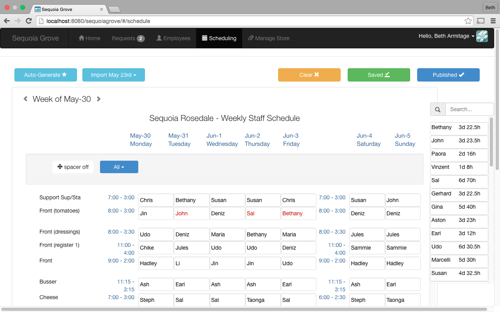

## Manage Store
Those with permissions to do so may manage the store information. Holidays
may be added to mark days the store has shorter hours or is closed. Shifts
may be edited, and expeted weekly deliveries may be edited.
Manage Holiday

Manage Shift
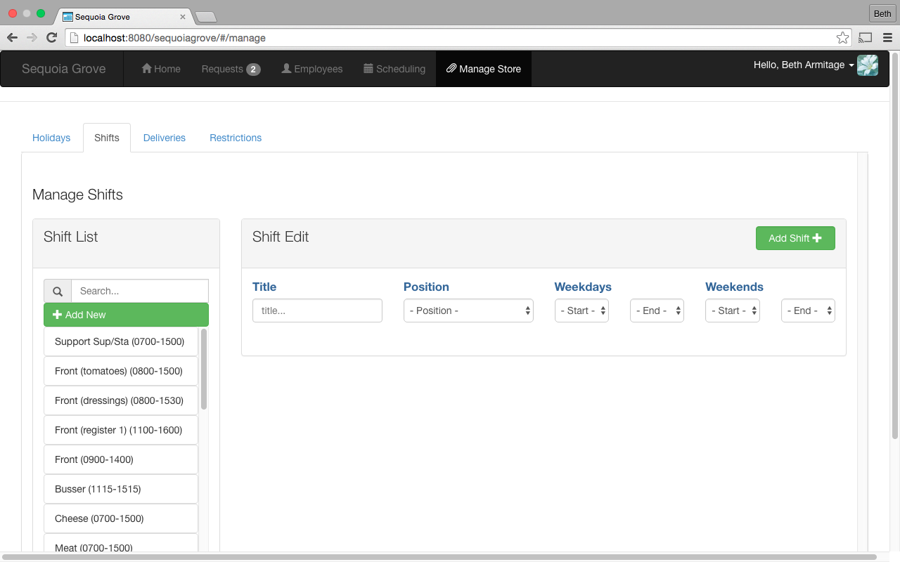
Manage Delivery
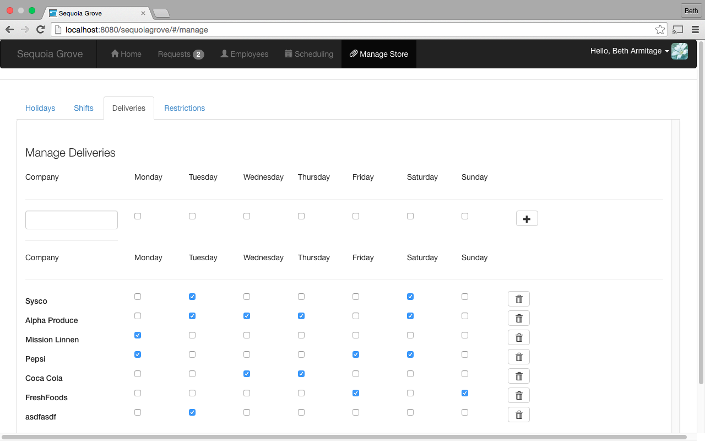

